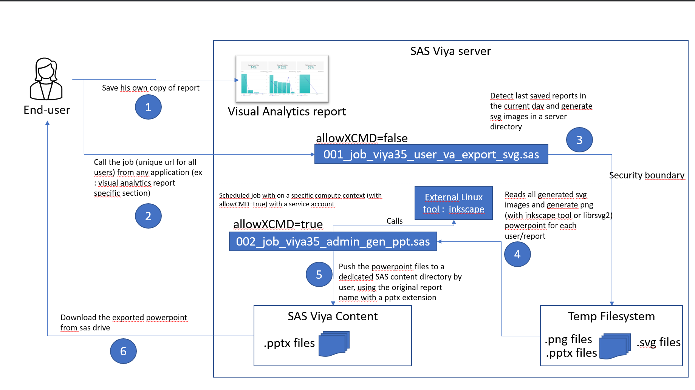

# viya_va_api_export_dev

The purpose of this project is to allow programmatic approach to SAS Viya (one for 3.5 and one for Viya 4) Visual Analytics report export through API and ODS Powerpoint use.

## For SAS Viya 3.5 (viya35ppt_gen subdirectory)

Find below a diagram explaining the cinematic implemented through the scripts provided in this project subfolder.
It has been tested on SAS Viya 3.5 environment installed on RHEL 7.9.
inkscape tool has been installed with the following command : sudo yum install inkscape. The release of Inkscape used for this test was 0.92.

